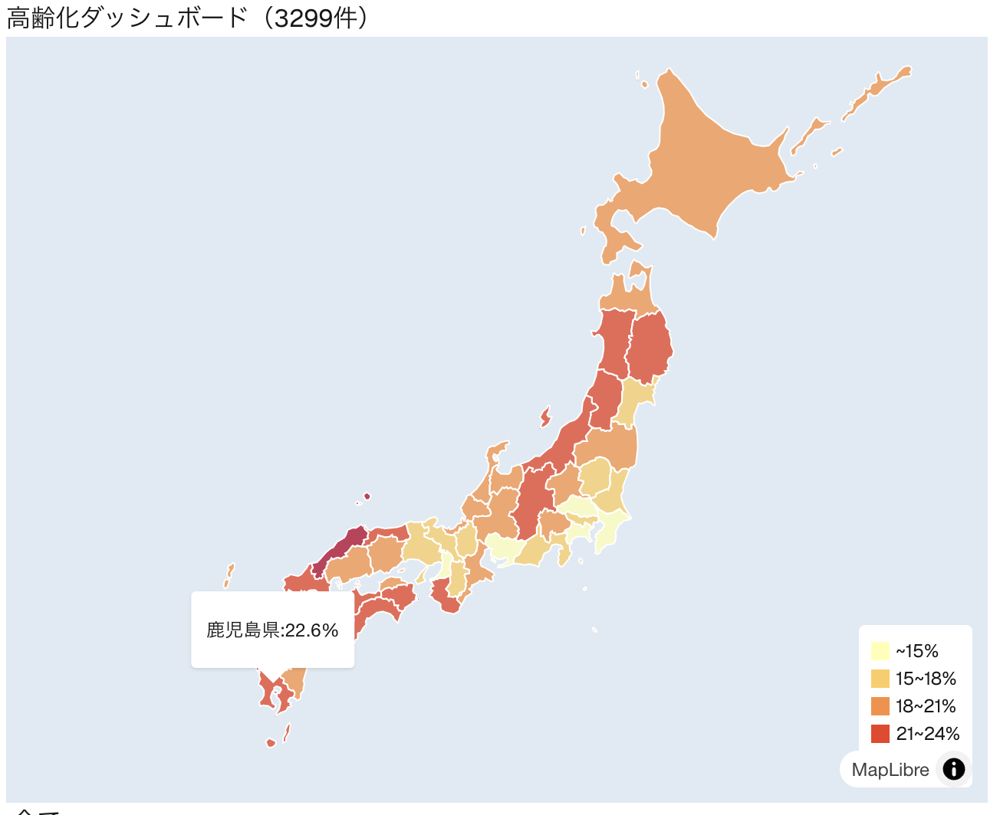
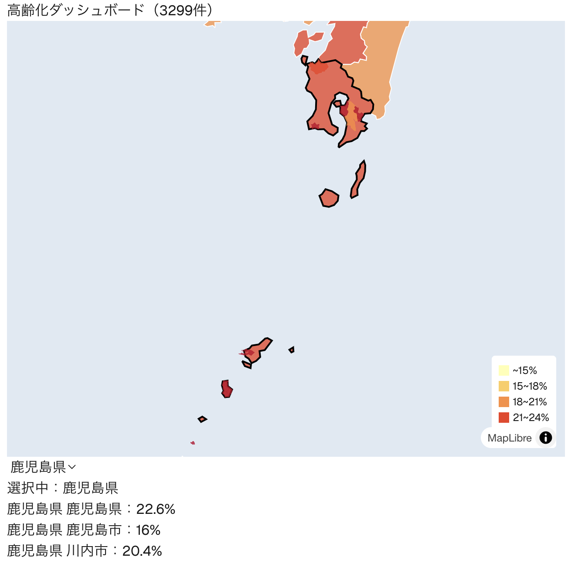
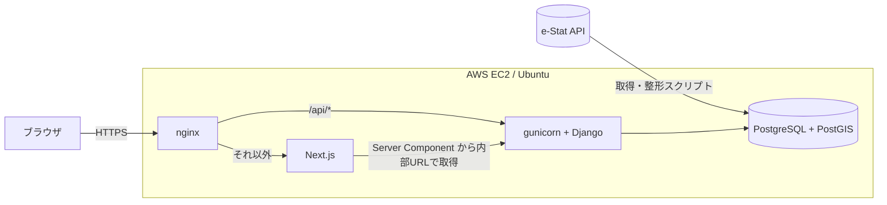

# estat-aging-dashboard

政府統計API（e-Stat）の市区町村データを、地図上で色分けして可視化するフルスタックWebアプリです。



🔗 デモ: https://estat-aging.duckdns.org
（※ 費用節約のため通常はサーバーを停止しています。ご覧になりたい場合はご連絡ください）

## 概要

- データ出典: [e-Stat](https://www.e-stat.go.jp/)（政府統計の総合窓口）API ／ 平成12年（2000年）国勢調査
- 全国の都道府県・市区町村の **高齢化率（65歳以上人口の割合）** を地図とリストで確認できます
- e-Stat から取得したデータを整形して PostgreSQL（PostGIS）に格納し、Django の API から配信しています

## 主な機能

- **都道府県コロプレス地図**：高齢化率に応じて都道府県を色分け（凡例・ホバーでツールチップ表示）
- **地図とプルダウンの連動**：地図クリックまたはプルダウンで都道府県を選択・ハイライト
- **地方での絞り込み**：地方を選ぶとその地方にズームし、地方の平均高齢化率を表示
- **市区町村ドリルダウン**：都道府県を選ぶと、その県の市区町村を色分け表示（境界データは PostGIS から GeoJSON で配信）



## 技術構成

| 領域 | 技術 |
| --- | --- |
| フロントエンド | TypeScript / React / Next.js（App Router）/ MapLibre GL JS |
| バックエンド | Python / Django / GeoDjango |
| データベース | PostgreSQL + PostGIS |
| インフラ | AWS EC2（Ubuntu）/ nginx / gunicorn / systemd / Let's Encrypt / DuckDNS |

## アーキテクチャ



## API

| エンドポイント | 内容 |
| --- | --- |
| `GET /api/aging/?pref=鹿児島県` | 都道府県・市区町村の高齢化率（JSON）。`pref` で絞り込み可 |
| `GET /api/cities/?pref=鹿児島県` | 市区町村の境界＋高齢化率（GeoJSON） |

## ローカルでの起動方法

前提：Python 3、Node.js、PostgreSQL + PostGIS、GDAL/GEOS（Mac は Homebrew で導入）

```bash
# バックエンド
cd backend
python -m venv venv && source venv/bin/activate
pip install -r requirements.txt
cp .env.example .env            # 値を自分の環境に合わせて編集
python manage.py migrate
python manage.py import_aging   # 高齢化率データを取り込み
python manage.py import_boundaries  # 市区町村境界を取り込み
python manage.py runserver

# フロントエンド（別ターミナル）
cd frontend
npm install
cp .env.example .env.local
npm run dev
```

http://localhost:3000 で表示されます。

## 工夫した点・詰まった点と解決

### 本番ビルドの失敗（サーバー用とブラウザ用の API URL を分離）

EC2 上で `npm run build` を実行したところ、トップページの生成でタイムアウトし、ビルドが失敗しました。
原因は、Server Component の `page.tsx` がビルド時にデータを取得する際、
まだ起動していない公開 URL（https://〜）にアクセスしていたことでした。
そこで、サーバー内部から取得する用の `INTERNAL_API_URL`（127.0.0.1:8000）と、
ブラウザから取得する用の `NEXT_PUBLIC_API_URL` に分けて解決しました。

サーバーで動くコードは `INTERNAL_API_URL` からデータを取り、
ブラウザで動くコードは `NEXT_PUBLIC_API_URL` からデータを取るように、
「どこで動くコードか」によって接続先を分ける必要があると学びました。

### 地図とプルダウンの連動（state を親コンポーネントへ）

地図のクリックとプルダウンのどちらで県を選んでも、同じ県がハイライトされるようにしたいと考えました。
そこで、選択中の県（`selectedPref`）を地図（PrefMap）と一覧（CityList）の共通の親である
Dashboard に持たせ、子コンポーネントには props で渡すようにしました。
地図がクリックされたときは、親から受け取った関数を呼んで親の state を更新します。

複数のコンポーネントで同じ情報を使うときは、その情報を親コンポーネントに持たせて、
子には props で渡すと、表示がずれなくなると学びました。

## 今後の予定

単一指標（高齢化率）の「閲覧ツール」から、複数指標の「分析ツール」へ拡張中です。

- **データを2020年国勢調査に更新**（e-Stat「社会・人口統計体系」の総人口・65歳以上人口から高齢化率を算出。合併後の現在の市区町村と境界データが一致するようになる）
- 指標の追加：人口増減率・財政力指数・生産年齢人口比率・1人あたり課税対象所得
- 指標を重み付けして合成した「課題スコア」（スライダーで重みを調整）
- 課題の大きい市区町村のランキングと地図ハイライト、Excel 出力

設計・実装計画・データ調査メモは [`docs/`](docs/) にあります。
